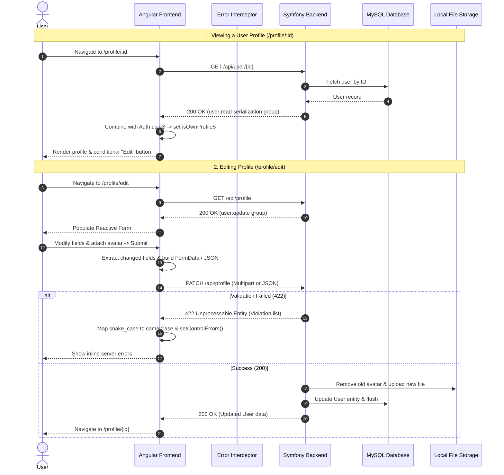

# 👤 Profile Feature Documentation (`Track Your Time`)

Comprehensive technical documentation and architectural specification for the **Profile Feature** in the Track Your Time application.

---

## 📑 Table of Contents
1. [Overview & Purpose](#-overview--purpose)
2. [System Architecture & Data Flow](#-system-architecture--data-flow)
3. [Routing & Access Control](#-routing--access-control)
4. [Frontend Implementation (Angular)](#-frontend-implementation-angular)
   - [Profile View Component (`ProfileIndex`)](#profile-view-component-profileindex)
   - [Profile Edit Component (`ProfileEdit`)](#profile-edit-component-profileedit)
   - [Profile Service (`Profile`)](#profile-service-profile)
   - [Data Models & Types](#data-models--types)
5. [Backend Implementation (Symfony)](#-backend-implementation-symfony)
   - [Profile Controller (`ProfileController`)](#profile-controller-profilecontroller)
   - [Identity Controller (`IdentityController`)](#identity-controller-identitycontroller)
   - [Data Transfer Object (`ProfileUpdateDTO`)](#data-transfer-object-profileupdatedto)
   - [User Entity (`User`) & Serialization Groups](#user-entity-user--serialization-groups)
   - [Custom Validators](#custom-validators)
   - [Avatar Upload & Storage Service (`FileUploaderService`)](#avatar-upload--storage-service-fileuploaderservice)
6. [API Specification](#-api-specification)
   - [`GET /api/user/{id}`](#1-get-apiuserid)
   - [`GET /api/profile`](#2-get-apiprofile)
   - [`PATCH /api/profile`](#3-patch-apiprofile)
7. [Security & Validation Pipeline](#-security--validation-pipeline)
8. [Roadmap & Planned Enhancements](#-roadmap--planned-enhancements)

---

## 🎯 Overview & Purpose

The **Profile Feature** in Track Your Time allows users to:
1. **View Profiles**: Access public profile pages for any registered user (displaying avatar, username, and full name).
2. **Context-Aware Controls**: Automatically detect if the authenticated user is viewing their own profile and display appropriate management options (e.g., "Edit your profile").
3. **Manage Personal Information**: Edit username, email, first name, and last name.
4. **Avatar Management**: Upload and update custom avatar images (JPEG, PNG, WebP) with automated server-side cleanup of orphaned images.
5. **Real-Time Client-Server Validation**: Benefit from responsive forms that capture both immediate client-side constraints and asynchronous server-side uniqueness violations.

---

## 🏗 System Architecture & Data Flow



---

## 🚦 Routing & Access Control

### Frontend Routes (`app.routes.ts`)

| Route Path | Component | Guard | Description |
| :--- | :--- | :--- | :--- |
| `/profile/:id` | `ProfileIndex` | `authGuard` (via child guard) | View public profile for user with ID `:id` |
| `/profile/edit` | `ProfileEdit` | `authGuard` (via child guard) | Edit form for currently logged-in user |

```typescript
{
    path: "profile",
    canActivateChild: [authGuard],
    children: [
        { path: "edit", component: ProfileEdit },
        { path: ":id", component: ProfileIndex },
    ]
}
```

> [!NOTE]
> All subroutes under `/profile` are protected by `canActivateChild: [authGuard]`. If an unauthenticated user attempts to visit either page, they are redirected to `/login`.

---

## 💻 Frontend Implementation (Angular)

### Profile View Component (`ProfileIndex`)
- **File**: `frontend/src/app/components/profile-index/profile-index.ts`
- **Template**: `frontend/src/app/components/profile-index/profile-index.html`

#### Key Mechanics:
1. **Dynamic Parameter Stream (`user$`)**:
   Subscribes to route changes using `ActivatedRoute.paramMap`, extracts `:id`, and delegates to `Profile.getProfileById(id)`.
2. **Profile Ownership Detection (`isOwnProfile$`)**:
   Uses RxJS `combineLatest` with `user$` and `Auth.user$`. If `viewedUser.id === currentUser.id`, `isOwnProfile$` emits `true`.
3. **Template Rendering**:
   - Displays avatar resolved via backend base path: `enviroment + user.avatar`.
   - Conditionally renders `<a [routerLink]="['/profile/edit']">` when `isOwnProfile$` is `true`.

---

### Profile Edit Component (`ProfileEdit`)
- **File**: `frontend/src/app/components/profile-edit/profile-edit.ts`
- **Template**: `frontend/src/app/components/profile-edit/profile-edit.html`

#### Key Mechanics:
1. **Reactive Form Setup**:
   ```typescript
   profileForm = this.fb.group({
     email: ['', [Validators.required, Validators.email]],
     username: ['', [Validators.required, Validators.minLength(3)]],
     first_name: ['', Validators.required],
     last_name: ['', Validators.required],
   });
   ```
2. **Pre-population**:
   Calls `Profile.getMyProfile()` on `ngOnInit()`, sets form values with `patchValue`, and saves a copy of initial values via `initialValue = this.profileForm.getRawValue()`.
3. **Dirty Field Detection (`getChangedFields()`)**:
   Compares current form values against `initialValue`. Only altered fields are included in the update payload. If nothing changed and no avatar is selected, update is aborted with a user prompt.
4. **Dynamic Avatar Handling**:
   Tracks file selection via `onAvatarSelected(event: Event)` to store the `File` object in `this.avatarFile`.
5. **Server Validation Error Mapping**:
   When backend returns HTTP 422:
   - Violations are keyed by snake_case property paths (e.g. `first_name`).
   - `toCamelCase()` converts keys to match Angular control names.
   - Attaches errors directly: `control?.setErrors({ server: message })`.
   - Real-time clearing: `valueChanges` subscription removes the `{ server: ... }` error key as soon as the user alters that field.

---

### Profile Service (`Profile`)
- **File**: `frontend/src/app/services/profile.ts`

| Method | Endpoint | Method Type | Payload | Returns | Description |
| :--- | :--- | :--- | :--- | :--- | :--- |
| `getProfileById(id)` | `/api/user/${id}` | `GET` | None | `Observable<UserData>` | Fetches public user details by ID |
| `getMyProfile()` | `/api/profile` | `GET` | None | `Observable<UserData>` | Fetches current user's profile details for editing |
| `updateProfile(credentials)` | `/api/profile` | `PATCH` | `FormData` or JSON | `Observable<UserData>` | Sends changed fields to update profile |

#### Smart Payload Serialization:
If `credentials.avatar` is a `File`, `updateProfile` converts the payload into `FormData` (`multipart/form-data`) using `toFormData()`. If no file is attached, it sends a pure JSON payload.

---

### Data Models & Types

- **`UserData`** (`frontend/src/app/models/user-data.ts`):
  ```typescript
  export interface UserData {
    id: number;
    email: string;
    username: string;
    last_name: string;
    first_name: string;
    avatar: string;
  }
  ```
- **`ProfileEditRequest`** (`frontend/src/app/models/profile-edit-request.ts`):
  ```typescript
  export interface ProfileEditRequest {
    email?: string;
    username?: string;
    last_name?: string;
    first_name?: string;
    avatar?: File | null;
  }
  ```

---

## ⚙️ Backend Implementation (Symfony)

### Profile Controller (`ProfileController`)
- **File**: `backend/src/Controller/ProfileController.php`

Three primary endpoints:
1. `index(int $id)`:
   - Route: `GET /api/user/{id}`
   - Permission: `IS_AUTHENTICATED_FULLY`
   - Finds `User` by ID. Serializes with context `["groups" => ["user:read"]]`.
2. `getEditInfo(#[CurrentUser] User $user)`:
   - Route: `GET /api/profile`
   - Permission: `IS_AUTHENTICATED_FULLY`
   - Returns the authenticated user serialized with `["groups" => ["user:update"]]`.
3. `edit(#[CurrentUser] User $user, ...)`:
   - Route: `PATCH /api/profile`
   - Permission: `IS_AUTHENTICATED_FULLY`
   - Handles both JSON requests and `multipart/form-data` uploads.
   - Deserializes into `ProfileUpdateDTO`.
   - Validates DTO against validation group `user:update`.
   - Updates entity fields selectively (`email`, `username`, `firstName`, `lastName`).
   - If avatar file is provided:
     - Removes previous avatar using `Symfony\Component\Filesystem\Filesystem`.
     - Invokes `FileUploaderService.profile` to save new image.
     - Updates user entity avatar property.
   - Persists changes with `EntityManagerInterface::flush()`.

---

### Identity Controller (`IdentityController`)
- **File**: `backend/src/Controller/IdentityController.php`
- Endpoint: `GET /api/me`
- Returns current logged-in user with `user:read` serialization group. Used during app initialization (`APP_INITIALIZER`) to hydrate session state.

---

### Data Transfer Object (`ProfileUpdateDTO`)
- **File**: `backend/src/DTO/ProfileUpdateDTO.php`

```php
class ProfileUpdateDTO
{
    #[Groups(['user:update'])]
    #[Assert\Email(mode: Assert\Email::VALIDATION_MODE_STRICT, groups: ["user:update"])]
    #[UniqueEmailConstraint(groups: ["user:update"])]
    public ?string $email = null;

    #[Groups(['user:update'])]
    #[Assert\Length(min: 3, max: 30, groups: ["user:update"])]
    #[UniqueUsernameConstraint(groups: ["user:update"])]
    public ?string $username = null;

    #[Groups(['user:update'])]
    #[SerializedName("first_name")]
    #[Assert\Length(max: 255, groups: ["user:update"])]
    public ?string $firstName = null;

    #[Groups(['user:update'])]
    #[SerializedName("last_name")]
    #[Assert\Length(max: 255, groups: ["user:update"])]
    public ?string $lastName = null;

    public ?UploadedFile $avatar = null;
}
```

---

### User Entity (`User`) & Serialization Groups
- **File**: `backend/src/Entity/User.php`

To prevent data leaks, serialization groups partition public versus sensitive data:
- **`user:read`**: Exposed when fetching public profiles (`id`, `username`, `first_name`, `last_name`, `avatar`). **Does NOT expose** `email`, `password`, `roles`, or `plainPassword`.
- **`user:update`**: Exposed only when the user requests their own edit info (`email`, `username`, `first_name`, `last_name`).

---

### Custom Validators
Located in `backend/src/Validator/`:
1. **`UniqueEmailConstraint` & `UniqueEmailConstraintValidator`**:
   Ensures that an updated email address does not collide with existing users, explicitly ignoring the currently authenticated user's own record.
2. **`UniqueUsernameConstraint` & `UniqueUsernameConstraintValidator`**:
   Ensures that an updated username does not collide with existing users, explicitly ignoring the currently authenticated user's own record.

---

### Avatar Upload & Storage Service (`FileUploaderService`)
- **File**: `backend/src/Service/FileUploaderService.php`
- Registered service instance: `App\Service\FileUploaderService.profile`
- Upload destination: `public/uploads/profile/`

#### Process:
1. **MIME Type Validation**:
   Only `image/jpeg`, `image/png`, and `image/webp` are permitted. Unsupported types throw a `FileException`.
2. **Filename Sanitization & Randomization**:
   ```php
   $safeFilename = $this->slugger->slug($originalFilename);
   $fileName = $safeFilename . "=" . uniqid() . "." . $file->guessExtension();
   ```
3. **Old Image Cleanup**:
   Before updating to the new file, `ProfileController` removes the old avatar file from disk using `Filesystem::remove($oldAvatar)` to prevent accumulation of dead assets.

---

## 📡 API Specification

### 1. `GET /api/user/{id}`
Retrieve public profile information by user ID.

- **Headers**: `Authorization: Bearer <token>` or JWT Cookie
- **Path Parameters**: `id` (integer, required)
- **Response (200 OK)**:
  ```json
  {
    "data": {
      "id": 1,
      "username": "speed_demon",
      "first_name": "Darius",
      "last_name": "Petrut",
      "avatar": "avatar=6aa857bd7382c.webp"
    }
  }
  ```
- **Error Responses**:
  - `401 Unauthorized`: Missing or invalid session.
  - `404 Not Found`: User does not exist (`{"error": "User not found."}`).

---

### 2. `GET /api/profile`
Retrieve personal profile data for pre-filling edit form.

- **Headers**: `Authorization: Bearer <token>` or JWT Cookie
- **Response (200 OK)**:
  ```json
  {
    "data": {
      "email": "darius@example.com",
      "username": "speed_demon",
      "first_name": "Darius",
      "last_name": "Petrut"
    }
  }
  ```

---

### 3. `PATCH /api/profile`
Update one or more fields of the current user's profile.

- **Headers**: `Content-Type: application/json` OR `multipart/form-data`
- **Request Body Parameters**:
  | Parameter | Type | Required | Description |
  | :--- | :--- | :--- | :--- |
  | `email` | String | No | Valid email address |
  | `username` | String | No | Username (3–30 characters) |
  | `first_name` | String | No | First name (max 255 chars) |
  | `last_name` | String | No | Last name (max 255 chars) |
  | `avatar` | File | No | Image file (JPEG, PNG, WebP) |

- **Response (200 OK)**:
  ```json
  {
    "data": {
      "id": 1,
      "username": "speed_demon",
      "first_name": "Darius",
      "last_name": "Petrut",
      "avatar": "new_avatar=6ba957cd7493d.webp"
    }
  }
  ```

- **Response (422 Unprocessable Entity)**:
  ```json
  {
    "data": {
      "username": "This username is already taken.",
      "email": "This email is already in use."
    }
  }
  ```

---

## 🛡 Security & Validation Pipeline

1. **Mass Assignment Protection**:
   Incoming request properties map strictly through `ProfileUpdateDTO`. Arbitrary fields (such as `roles`, `password`, or `id`) cannot be modified through the profile endpoint.
2. **Context-Aware Uniqueness**:
   Unique entity checks exclude the current user's ID, preventing false-positive errors when saving unmodified unique fields.
3. **Session & Token Refresh (`errorInterceptor`)**:
   Expired tokens returning HTTP 401 trigger an automatic background refresh request (`POST /api/token/refresh`) before retrying pending profile operations.
4. **Filesystem Security**:
   - Avatars are given unique randomized names.
   - MIME types are strictly verified before writing to disk.

---

## 🗺 Roadmap & Planned Enhancements

- [ ] **Profile Tabs & Activity**:
  - **Garage**: Display cars associated with the user (`User::$cars`).
  - **Circuit Times**: Display track lap times recorded by the user (`User::$circuitTimes`).
  - **Friends**: Show accepted friends and mutual connections (`User::$sentFriendships`, `User::$receivedFriendships`).
- [ ] **Client-Side Image Crop / Preview**:
  - Add client-side cropping and compression modal before uploading avatar files.
- [ ] **Password Change Section**:
  - Add optional password update accordion inside Profile Edit requiring current password confirmation.
